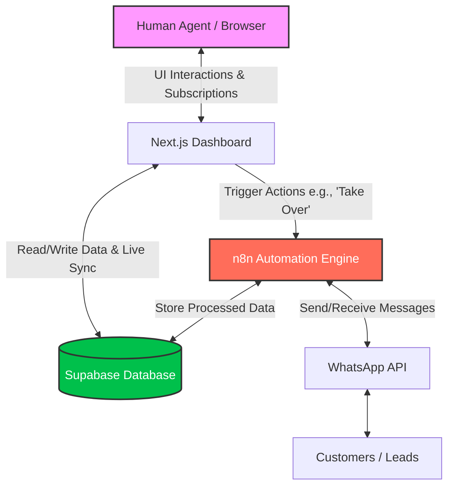
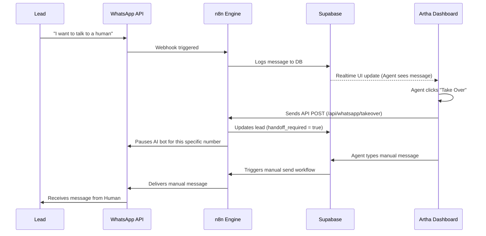

# 🚀 Artha Sales Automation Dashboard

Welcome to the **Artha Sales Automation Dashboard**, a comprehensive, real-time command center designed to manage leads, automate conversations, and give human agents full control over AI-driven interactions. 

---

## 🎯 What are we doing & Why?

Modern sales teams struggle with scaling their outreach while maintaining a personalized touch. AI chatbots (like a WhatsApp AI agent) can handle 80% of routine inquiries, but they often fail when a lead asks complex questions or is ready to close a deal.

**The Solution:** Artha Sales Automation is a hybrid system. 
- The **AI handles the top of the funnel** (qualifying leads, answering basic questions via WhatsApp).
- The **Dashboard gives human agents a God's-eye view** of all conversations.
- If the AI gets stuck, a human agent can click **"Take Over"**, pause the AI, and seamlessly continue the conversation.

This ensures **zero dropped leads**, **high efficiency**, and **perfect customer experience**.

---

## 🏗️ High-Level Architecture

The system is built on three main pillars:
1. **Frontend (This Dashboard):** Next.js & TailwindCSS. Provides the UI for agents.
2. **Database & Realtime (Supabase):** Stores leads, conversations, and appointments. Pushes live updates to the dashboard.
3. **Automation Engine (n8n):** Handles the logic, talks to the WhatsApp API, and routes webhooks.



---

## 🧩 Core Modules Explained

### 1. 📊 Dashboard Analytics (`/`)
Provides a high-level overview of the sales funnel. 
- **KPI Cards:** Total leads, conversion rates, active AI conversations.
- **Charts:** Lead distribution by tier and pipeline stage.

### 2. 💬 WhatsApp Interface (`/whatsapp`)
A complete WhatsApp Web clone built directly into the dashboard.
- **Live Sync:** Watch the AI converse with leads in real-time.
- **Human Takeover:** If a lead gets frustrated or is ready to buy, the agent clicks "Take Over". The AI goes to sleep, and the human types directly from the dashboard.

### 3. 👥 Leads Management (`/leads`)
A CRM view for all prospects.
- **Kanban Board & Tables:** Move leads through stages (New -> Exploring -> Engaged -> Qualified -> Sales Ready).
- **AI Scoring:** Leads are automatically scored based on their interactions.

### 4. 📅 Appointments (`/appointments`)
Tracks scheduled meetings. If the AI successfully books a demo, it appears here automatically.

### 5. 🧠 Knowledge Base (`/knowledge`)
The "brain" for the AI. Upload documents (PDFs, text) here so the AI knows what to say. It also detects "Knowledge Gaps" (questions the AI didn't know how to answer) so you can fill them.

---

## 🔄 The "Human Takeover" Flow

Here is exactly what happens when an agent intervenes in an AI conversation:



---

## 🛠️ Tech Stack & Getting Started

**Tech Stack:**
- **Framework:** Next.js 15 (App Router)
- **Styling:** Tailwind CSS + Custom UI Components
- **Icons:** Lucide React
- **Backend/DB (Planned):** Supabase (PostgreSQL)
- **Automation (Planned):** n8n

### Installation

1. Clone the repository:
```bash
git clone https://github.com/AnirudhPratapSinghYadav/Artha-Sales-Automation-Dashboard.git
cd Artha-Sales-Automation-Dashboard
```

2. Install dependencies:
```bash
npm install
```

3. Run the development server:
```bash
npm run dev
```

4. Open [http://localhost:3000](http://localhost:3000) with your browser to see the result.

### Environment Variables
To connect this to your live Supabase and n8n instances, configure your `.env.local`:
```env
NEXT_PUBLIC_SUPABASE_URL=your_supabase_url
NEXT_PUBLIC_SUPABASE_ANON_KEY=your_supabase_anon_key
N8N_WEBHOOK_URL=your_n8n_instance_url
API_SECRET_KEY=your_secure_api_key
```

*(Currently, the app runs on robust mock data via `src/lib/data.ts` to allow UI development without a backend. To switch to live data, update the functions in that file to hit Supabase.)*
