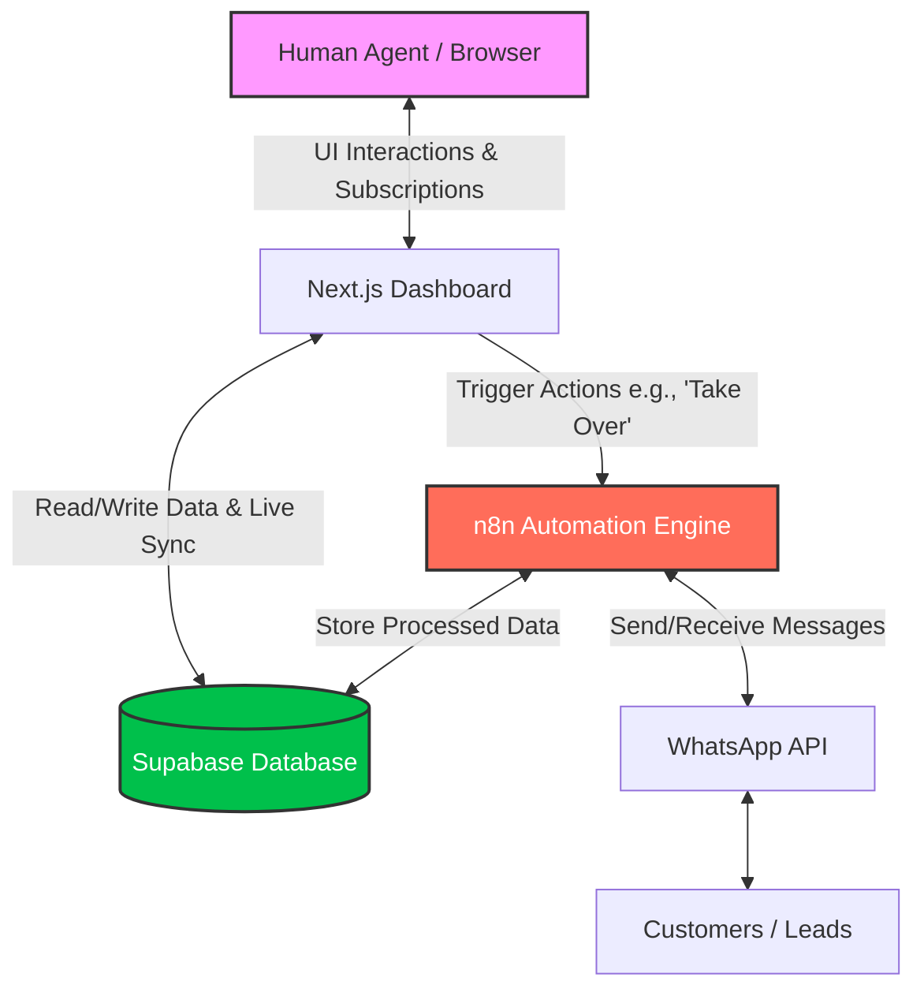
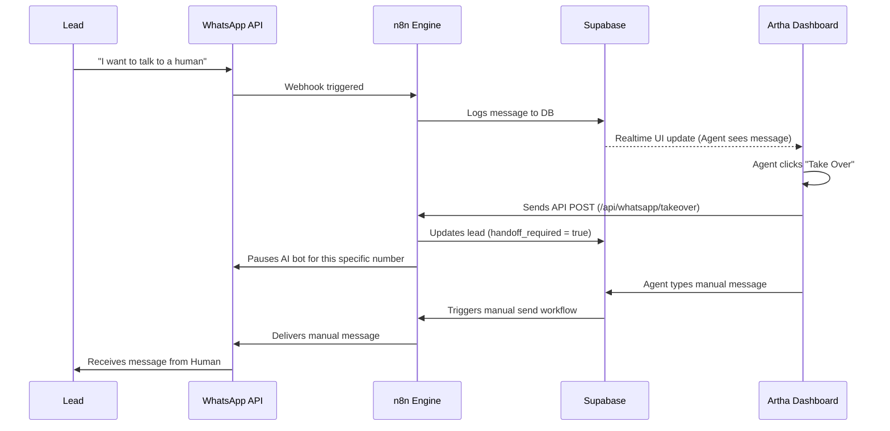

# Artha Sales Automation Dashboard

A Next.js (App Router) dashboard that acts as the control center for an AI-driven sales and lead generation system. It connects to a Supabase PostgreSQL database for real-time state management and uses n8n for workflow automation and WhatsApp API integrations.

---

## Architecture Overview

The system is decoupled into three layers:

1. **Frontend (This Repo)**: A Next.js 15 application built with Tailwind CSS. It handles the UI, data visualization, and real-time socket connections.
2. **Database (Supabase)**: The single source of truth. It stores `leads`, `conversations`, `appointments`, and `knowledge` documents.
3. **Automation Engine (n8n)**: Acts as the middleman between the WhatsApp API and Supabase. It processes incoming messages, triggers AI responses, and handles the "human takeover" webhooks.



### The "Human Takeover" Flow

By default, an AI agent handles the WhatsApp conversations. When the AI fails to answer a question or the lead is ready to buy, a human agent can intervene via the dashboard.



---

## Project Structure

This project follows a strict domain-driven architecture to avoid monolithic "god files" and maintain clean separation of concerns.

```text
src/
├── app/                  # Next.js App Router pages (Dashboard, Leads, WhatsApp, etc.)
├── components/           # React UI components organized by domain
│   ├── dashboard/
│   ├── leads/
│   ├── whatsapp/
│   └── ui/               # Reusable primitives (Buttons, Dialogs, Badges)
├── lib/                  # Core business logic and integrations
│   ├── services/         # Data fetching layer (e.g., leads.service.ts)
│   ├── types/            # TypeScript interfaces and type definitions
│   ├── mocks/            # Mock data for local development without DB
│   ├── supabase.ts       # Supabase client initialization
│   └── n8n.ts            # Webhook interaction logic
└── proxy.ts              # Edge middleware for rate-limiting and security headers
```

---

## Security Posture

To protect against basic application-layer threats:
- **Edge Middleware (`src/proxy.ts`)**: Implements an in-memory sliding-window rate limiter for `/api/*` routes to prevent basic burst abuse.
- **Strict Headers (`next.config.ts` & `src/proxy.ts`)**: Enforces `Content-Security-Policy`, `X-Frame-Options` (DENY), `X-Content-Type-Options` (nosniff), and `Strict-Transport-Security`.
- *Note: True DDoS mitigation (L3/L4/L7 volumetric attacks) relies on your edge network provider (e.g., Vercel, Cloudflare) rather than Next.js logic.*

---

## Local Development

### Prerequisites
- Node.js 18+
- npm or yarn

### Setup

1. **Clone the repository**
   ```bash
   git clone https://github.com/AnirudhPratapSinghYadav/Artha-Sales-Automation-Dashboard.git
   cd Artha-Sales-Automation-Dashboard
   ```

2. **Install dependencies**
   ```bash
   npm install
   ```

3. **Configure Environment Variables**
   Create a `.env.local` file in the root directory:
   ```env
   NEXT_PUBLIC_SUPABASE_URL=your_supabase_url
   NEXT_PUBLIC_SUPABASE_ANON_KEY=your_supabase_anon_key
   ```

4. **Start the dev server**
   ```bash
   npm run dev
   ```
   The dashboard will be available at [http://localhost:3000](http://localhost:3000).

*(Note: The `src/lib/services/` layer is currently configured to run queries against Supabase. Ensure your database tables (`leads`, `conversations`, etc.) are provisioned correctly based on the types defined in `src/lib/types/`.)*
